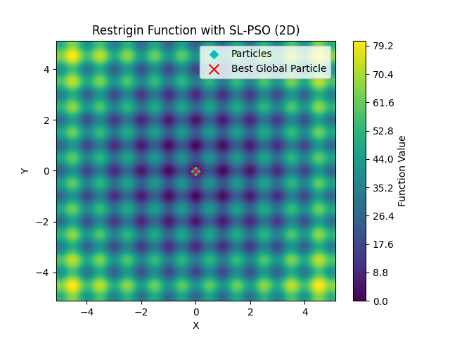

# SLPso - Social Learning Particle Swarm Optimization

[](https://opensource.org/licenses/MIT)


SLPso is a Python library that implements the Social Learning Particle Swarm Optimization (SL-PSO) algorithm for scalable optimization problems, as described in the following article:

## About the Algorithm

**A Social Learning Particle Swarm Optimization Algorithm for Scalable Optimization**
*Authors: Ran Cheng and Yaochu Jin*
*Journal: Information Sciences, Volume 291, Pages 43-60, Year 2015*
*DOI: [10.1016/j.ins.2014.08.039](https://doi.org/10.1016/j.ins.2014.08.039)*
*URL to the Paper: [Read the full paper](https://www.sciencedirect.com/science/article/pii/S0020025514008366)*

If you use the SLPso library in your research, please consider citing this library.

<details>
<summary>Reveal quote</summary>

**SLPso - Social Learning Particle Swarm Optimization** [Software]. (2023).  Available at: [https://github.com/vsg-root/slpso](https://github.com/vsg-root/slpso).

</details>


## About SL-PSO

The Social Learning Particle Swarm Optimization is a population-based optimization algorithm inspired by the behavior of a swarm of particles. It leverages social interactions to enhance exploration of the search space and convergence to optimal solutions in scalable optimization problems.

#### **Restrigin** Function


#### **Ackley** Function


## Installation

To get started with SLPso, you can install it via pip:

```bash
pip install slpso
```
### Try your first SL-PSO program

```python
>>> from slpso.slpso import SLPSO
>>> import numpy as np

>>> def custom_objective_function (positions: np.ndarray) -> np.ndarray: # Fitness Function 
    """
    Example objective function to be minimized.

    Parameters:
    - positions: Particle positions.

    Returns:
    - Array of objective function values for each particle.
    """
>>> return np.sum(positions ** 2, axis=1)

# Define a desired random seed to control randomness
>>> random_seed = 40  # None

>>> slpso_optimizer = SLPSO(custom_objective_function, random_seed=random_seed)
>>> global_best_position, global_best_value = slpso_optimizer.optimize()

>>> print("Global Best Position:", global_best_position)
>>> print("Global Best Value:", global_best_value)
```


**Note:** This library is not affiliated with or endorsed by the original researchers. It is an independent implementation of the SL-PSO algorithm for the convenience of users interested in applying it to their optimization problems. Please do not confuse this library with the work of the original authors.
