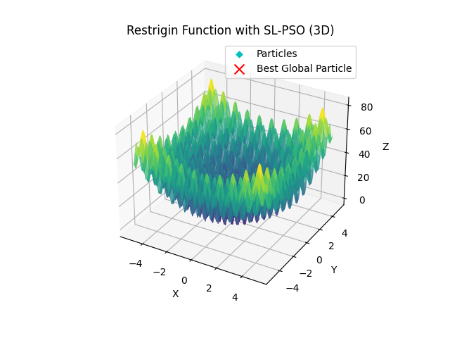
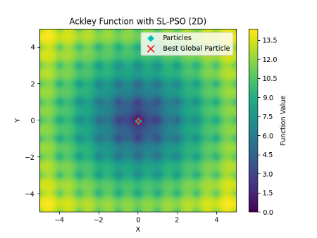
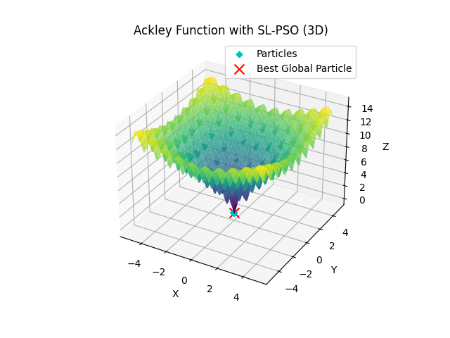

# SLPso - Social Learning Particle Swarm Optimization

[](https://opensource.org/licenses/MIT)


SLPso is a Python library that implements the Social Learning Particle Swarm Optimization (SL-PSO) algorithm for scalable optimization problems.

## About the Algorithm
This library used this article as a basis:

**A Social Learning Particle Swarm Optimization Algorithm for Scalable Optimization**
*Authors: Ran Cheng and Yaochu Jin*
*Journal: Information Sciences, Volume 291, Pages 43-60, Year 2015*
*DOI: [10.1016/j.ins.2014.08.039](https://doi.org/10.1016/j.ins.2014.08.039)*
*URL to the Paper: [Read the full paper](https://www.sciencedirect.com/science/article/pii/S0020025514008366)*

If you use the SLPso library in your research, please consider citing this library.

<details>
<summary>Reveal quote</summary>

**SLPso - Social Learning Particle Swarm Optimization** [Software]. (2023).  Available at: [https://github.com/vsg-root/slpso](https://github.com/vsg-root/slpso).

</details>


## About SL-PSO

The Social Learning Particle Swarm Optimization is a population-based optimization algorithm inspired by the behavior of a swarm of particles. It leverages social interactions to enhance exploration of the search space and convergence to optimal solutions in scalable optimization problems.

## Important Note

It is crucial to highlight that **this library's performance did not match the results reported in the referenced paper.** The following results were obtained through extensive experiments, each run 30 times for different dimensions, with 100 particles, and a total of 200,000 fitness evaluations for each experiment.


| Fitness Function | Dimensions | Mean                        | Std Deviation                | Median                      | Min                          | Max                          | Range                        | Q1                            | Q3                            | IQR                           | Variance                     | Skewness                    | Kurtosis                    |
|------------------|------------|-----------------------------|-----------------------------|-----------------------------|------------------------------|------------------------------|------------------------------|------------------------------|------------------------------|------------------------------|------------------------------|-----------------------------|-----------------------------|
| SPHERE           | 30         | 5.134558019081858e-11       | 1.211573733802829e-10       | 3.1972817225073955e-12      | 4.4945773854107465e-16       | 5.986819195679123e-10       | 5.986814701101737e-10       | 2.9859581900977795e-13      | 3.251560493779558e-11       | 3.2217009118785803e-11      | 1.4679109124409284e-20     | 3.4435550697350905         | 11.798271084510283         |
| SPHERE           | 50         | 3.1584261753156247e-10     | 6.792711505729422e-10       | 3.4316434742542265e-11      | 2.7409774060359484e-14      | 3.010168883977346e-09       | 3.0101414742032854e-09     | 6.42113837282396e-12        | 1.7699723002759717e-10      | 1.705760916547732e-10      | 4.614092960006887e-19     | 2.6709565087165865         | 6.567008105867542         |
| SPHERE           | 100        | 1.005216832091723e-08      | 3.647717244695249e-08      | 1.7911544858165785e-10     | 9.215853894494535e-13      | 1.8900039131765382e-07     | 1.8899946973226437e-07     | 3.3801813733547646e-11     | 1.1785157115165747e-09      | 1.1447138977830272e-09      | 1.33058410972471e-15      | 4.195355816196843          | 16.86916426877996         |
| ROSENBROCK       | 30         | 28.923482490463268         | 0.04500651927005465         | 28.923337718279587         | 28.81963237879423          | 28.998061437860382          | 0.17842905906615414          | 28.891333575211167          | 28.950178360806476          | 0.05884478559530848          | 0.0020255867768058005       | -0.13859220945212242        | -0.6228782068911034        |
| ROSENBROCK       | 50         | 48.907862303712356         | 0.04537403676190812         | 48.898013380701144         | 48.83657712695772          | 48.99587809168467          | 0.15930096472695254          | 48.877013190664904          | 48.93975003690697          | 0.06273684624206766          | 0.0020588032120709894       | 0.36791987093360173         | -0.8196783162232522        |
| ROSENBROCK       | 100        | 98.91765601157664         | 0.04344390194136185         | 98.92401512512825         | 98.7834265901218          | 98.9900405563796          | 0.20661396625779105          | 98.894469238539          | 98.94378122363197          | 0.04931198509297019          | 0.001887372615890664       | -0.8073118959528298         | 1.060956932436521         |
| ACKLEY           | 30         | 1.8581857145427706e-06      | 3.2137530656187338e-06      | 4.314292447737955e-07      | 2.9408891766280476e-08      | 1.4202264264628894e-05      | 1.4172855372862614e-05      | 2.1138431938183544e-07      | 1.65273592189763e-06       | 1.4413516025157946e-06     | 1.0328208766773809e-11     | 2.463510183031419          | 5.611901107657776         |
| ACKLEY           | 50         | 5.155172783558962e-06      | 9.549253308682445e-06      | 7.335498986016376e-07      | 4.308880763304046e-08      | 3.642144825777294e-05      | 3.6378359450139897e-05      | 2.0976514170101268e-07      | 2.310288408136074e-06       | 2.1005232664350615e-06     | 9.118823875338264e-11     | 2.121842818890628          | 3.3324545846026723         |
| ACKLEY           | 100        | 6.42689450680578e-06       | 1.1422543607834733e-05      | 1.9984761086000447e-06     | 1.0009744189076741e-07      | 5.788079827739878e-05      | 5.7780700835508014e-05     | 7.557297379001682e-07        | 7.96762023513864e-06       | 7.211890497238471e-06     | 1.3047450247288612e-10    | 3.2599862542623907         | 11.26169095577243        |
| RESTRIGIN        | 30         | 6.52501520714092e-06       | 2.8866918764332522e-05      | 1.4017587091075256e-10     | 0.0                        | 0.00015890407627239256     | 0.00015890407627239256     | 2.8137492336099967e-12      | 1.3390462072493392e-09      | 1.3362324580157292e-09      | 8.33298998946573e-10      | 4.9145058955991825         | 22.90227152644927         |
| RESTRIGIN        | 50         | 9.653755959509343          | 51.987065729665325          | 3.3938363230845425e-10     | 1.1368683772161603e-13     | 289.61267275309126         | 289.61267275309115         | 2.3462121134798508e-11     | 2.0741680373248528e-08      | 2.071821825211373e-08      | 2702.655003180543          | 5.199469468957449          | 25.034482758620673         |
| RESTRIGIN        | 100        | 2.4878783100727257e-05     | 7.070461110242559e-05      | 2.0902461983496323e-09     | 1.9326762412674725e-12     | 0.00029333075724480295     | 0.0002933307553121267     | 2.1861978893866763e-10     | 3.061627751321794e-07      | 3.059441553432407e-07      | 4.999142031145244e-09     | 2.8629109484039823         | 6.75084678650421         |
| GRIEWANK         | 30         | 2.267632441081228e-09      | 1.1128161890505749e-08     | 2.387756659061324e-12     | 3.219646771412954e-15      | 6.209523173428266e-08      | 6.209522851463589e-08      | 4.866385072688217e-13      | 2.986705327501227e-11      | 2.9380414767743446e-11     | 1.238359870613045e-16     | 5.172511236431533          | 24.849301663364827         |
| GRIEWANK         | 50         | 4.408185150239774e-10      | 1.0696470727780055e-09     | 3.4989788844086434e-12    | 1.8318679906315083e-14     | 4.250454765930556e-09     | 4.2504364472506495e-09     | 4.2829628732476976e-13     | 1.856980680337017e-10      | 1.8526977174637693e-10     | 1.1441448603025557e-18    | 2.773943675594774          | 6.393008795098767         |
| GRIEWANK         | 100        | 2.6623641533089307e-06     | 1.4312765073892532e-05     | 1.8766388443225424e-10    | 3.306244167333716e-13     | 7.973893190316161e-05      | 7.97389315725372e-05      | 1.7809975716431836e-11     | 1.540978095126988e-09      | 1.5231681194105562e-09     | 2.0485524406043792e-10    | 5.19946274553209           | 25.034437794381216        |


#### - **Restrigin** Function

<div align="center">
  <table>
    <tr>
      <td align="center">
        
      </td>
      <td align="center">
        
      </td>
    </tr>
    <tr>
      <td align="center"></td>
      <td align="center"></td>
    </tr>
  </table>
</div>

#### - **Ackley** Function

<div align="center">
  <table>
    <tr>
      <td align="center">
        
      </td>
      <td align="center">
        
      </td>
    </tr>
    <tr>
      <td align="center"></td>
      <td align="center"></td>
    </tr>
  </table>
</div>


## Installation

To get started with SLPso, you can install it via pip:

```bash
pip install slpso
```
### Try your first SL-PSO program

```python
>>> import numpy as np
>>> from slpso.slpso import SLPSO

>>> def custom_objective_function(positions: np.ndarray) -> np.ndarray:
    """
    The custom objective function to be minimized.

    Args:
        positions (np.ndarray): An array of particle positions.

    Returns:
        np.ndarray: An array of fitness values.
    """
>>>     return np.sum(positions ** 2, axis=1)

>>> lower_bound = -30.0  # Set the lower bound
>>> upper_bound = 30.0   # Set the upper bound

>>> slpso_optimizer = SLPSO(custom_objective_function,
                            seed=1,
                            lower_bound=lower_bound,
                            upper_bound=upper_bound,
                            show_progress=False)

>>> global_best_position, global_best_value = slpso_optimizer.optimize()
>>> print("Global Best Position:", global_best_position)
>>> print("Global Best Value:", global_best_value)
```


**Note:** This library is not affiliated with or endorsed by the original researchers. It is an independent implementation of the SL-PSO algorithm for the convenience of users interested in applying it to their optimization problems. Please do not confuse this library with the work of the original authors.
